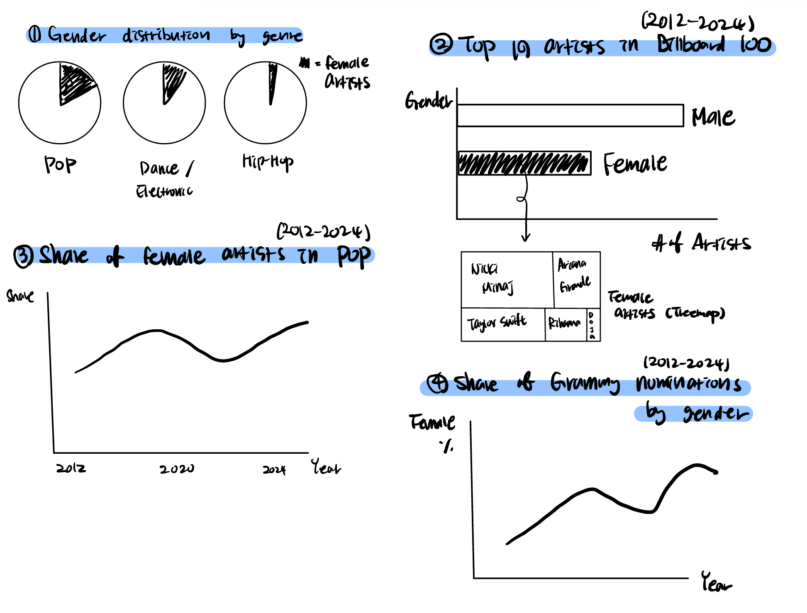

| [home page](https://cmustudent.github.io/tswd-portfolio-templates/) | [data viz examples](dataviz-examples) | [critique by design](critique-by-design) | [final project I](final-project-part-one) | [final project II](final-project-part-two) | [final project III](final-project-part-three) |

<h1>Outline</h1>

  <strong>One-sentence Project Summary:</strong> 
  [Gender Representation in Pop Music Industry] I plan to study how the presence of female artists in popular music has changed from 2012 to 2024.

  This project examines how the presence of female artists in popular music has changed from 2012 to 2024 and what these trends reveal about gender representation across the broader music ecosystem. Using publicly available datasets, I analyze three core dimensions of the industry: the gender distribution of popular songs by genre, the year-to-year share of female artists in pop music, and the gender breakdown of Grammy nominations. Together, these datasets allow me to explore how visible female artists have been in popular music.

  The goal of this project is to visualize how female artist participation has evolved over time and to identify what may have driven those changes. By comparing overall gender trends with genre-specific patterns and award recognition, I hope to uncover whether the rise in female visibility reflects broader cultural shifts, changes within specific genres, or persistent gaps between commercial success and institutional acknowledgment. Ultimately, this project aims to present a clear, data-driven narrative about how women’s roles in popular music have progressed over the past decade and where disparities still remain.

<h2>Project Structure</h2>

<h3>1. Beginning — Setting the Stage / Problem Statement</h3>

<h4>Central Question</h4>

<strong>How has the presence of female artists in popular music changed from 2012 to 2024?</strong>

<h4>Context & Importance</h4>

Explain why gender representation in music matters culturally, socially, and economically, 
and why shifts in visibility offer insight into the broader music ecosystem.

<h3>2. Middle — Rising Action / Data Exploration and Analysis</h3>

<h4>A. Overall Trend: Female Representation Over Time</h4>
<ul>
  <li>Line chart showing the annual share of female artists (2012–2024).</li>
  <li>Identify years of growth, stagnation, or decline.</li>
</ul>

<h4>B. Genre Layer: How Genre Shapes Gender Representation</h4>
<ul>
  <li>Compare which genres historically include more vs. fewer women.</li>
  <li>Analyze whether shifts in genre popularity help explain changes in overall female representation.</li>
</ul>

<h4>C. Industry Recognition: Grammy Nominations by Gender</h4>
<ul>
  <li>Compare Billboard visibility with Grammy nomination data.</li>
  <li>Identify alignment or gaps between commercial popularity and institutional recognition.</li>
  <li>Assess whether increased chart presence is reflected in awards.</li>
</ul>

<h4>D. Synthesizing the Layers</h4>
<ul>
  <li>Do increases in female visibility correlate with changes at the genre level?</li>
  <li>Is institutional recognition keeping pace with chart trends?</li>
  <li>Are any disparities persistent over time?</li>
</ul>

<h3>3. Climax — Key Insight</h3>

<strong>Present the single most important conclusion revealed by the combined datasets.</strong>

<h3>4. Falling Action — Interpretation and Implications</h3>
<ul>
  <li>Discuss what the findings suggest about representation.</li>
  <li>Discuss what they imply about opportunity.</li>
  <li>Discuss structural dynamics within the music industry.</li>
</ul>

<h3>5. Closing — Bringing It All Together</h3>
<ul>
  <li>Summarize the overall story emerging from the visualizations.</li>
  <li>Reflect on what these trends imply for gender representation in music today.</li>
  <li>Suggest opportunities for future research or industry actions to address remaining disparities.</li>
</ul>

<h2>The Initial Sketch</h2>

<h2>The Data</h2>

  The dataset used in this project was originally created by the 
  <strong>MDSC Initiative</strong> and sourced from <strong>Statista</strong>. 
  This data provides annual breakdowns that allow for examining trends in the 
  visibility and representation of female artists over time.

| Dataset Description                                                                            | Link |
|------------------------------------------------------------------------------------------------|------|
| Share of Grammy nominations in the United States from 2013 to 2024, by gender                 | [link](https://www-statista-com.cmu.idm.oclc.org/statistics/801372/gender-grammy-nominees/) |
| Share of female artists in popular music in the United States from 2012 to 2024               | [link](https://www-statista-com.cmu.idm.oclc.org/statistics/801059/share-of-females-popular-music/) |
| Solo artists with the most songs in the Billboard Top 100 in the United States from 2012–2024 | [link](https://www-statista-com.cmu.idm.oclc.org/statistics/801333/artists-most-songs-billboard-top-100/) |
| Gender distribution of popular songs in the United States from 2012 to 2023, by genre         | [link](https://www-statista-com.cmu.idm.oclc.org/statistics/801266/gender-distribution-popular-songs-genre/) |

# Method and medium
I plan to use Shorthand and Tableau.

